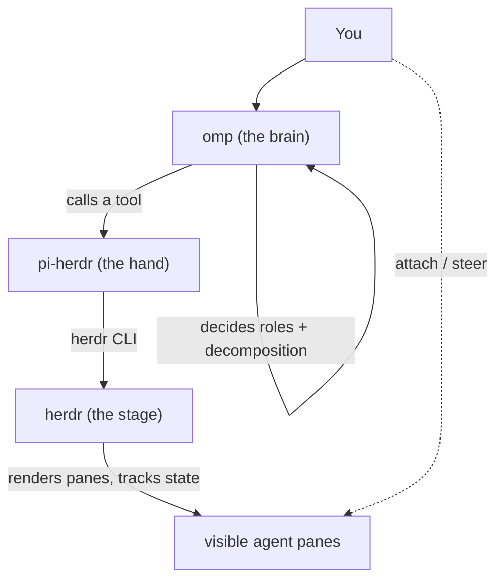

# Turning omp into a self-orchestrating fleet with herdr

> How to make [**omp**](https://github.com/) (a pi-family coding agent) *decide by
> itself* to spawn a **coordinator** and **workers** in visible
> [herdr](https://herdr.dev) panes — and the three omp-compatibility bugs that had
> to be fixed in `pi-herdr` to make it actually work.
>
> This is the write-up for **[pi-herdr-omp](https://github.com/Bobdddd/pi-herdr-omp)**,
> an omp-oriented build derived from **[AndrewJacop/pi-herdr](https://github.com/AndrewJacop/pi-herdr)** (MIT).

---

## The goal

I wanted one thing: a coding agent that, from a single sentence, **decides how to
split the work**, spins up helper agents **in windows I can watch and type into**,
and pulls the results back together. Concretely:

- I talk to **one** omp session.
- It figures out whether the task needs a **coordinator** + **workers**.
- Each helper runs in its **own visible pane** — I can attach and steer any of them
  at any moment.

Most "multi-agent" tools do only half of this. Terminal managers like
`claude-squad` give you the panes + git-worktree isolation, but **you** do the
decomposition by hand. Meanwhile the LLM-driven subagent tools auto-decompose but
usually run children headless. I wanted **both**.

## The stack: three layers, three jobs

The trick is to stop looking for one tool and instead compose three, each doing
exactly one job:



| Layer | Role | What it decides |
| --- | --- | --- |
| **omp** | the brain | *whether* to split, *who* is coordinator/worker, *what* each does |
| **pi-herdr** | the hand | translates the brain's decision into `herdr` commands |
| **herdr** | the stage | opens panes, runs processes, tracks agent state, lets you attach |

The important correction: **roles live in omp, not herdr.** herdr never knows what
a "coordinator" is — to it, everything is just "a pane running an agent of kind
`omp`." The *identity* of a coordinator/worker is given by omp via a system
prompt. herdr is only the passive stage that hosts the process and lets you watch.

## Roles are markdown, and they are NOT skills

A "coordinator" or "worker" is just a **role prompt** — plain markdown fed to a
fresh omp via `--append-system-prompt`. This is a *persona*, not a *skill* (a skill
is a playbook that teaches an agent when/how to do something; a role defines *who
the agent is*).

`coordinator.md`:

```markdown
# Role: COORDINATOR
You decompose the task and delegate; you never do the work yourself.
1. Split the task into INDEPENDENT slices.
2. For each slice, `herdr_delegate` a worker:
   - agent: "omp"
   - agentArgs: ["--append-system-prompt", "/abs/path/to/worker.md"]
   - prompt: the self-contained slice
   Run the delegate calls in PARALLEL.
3. Combine every worker's answer into one labeled report.
Analysis only. Never edit files.
```

`worker.md`:

```markdown
# Role: WORKER
You were spawned to handle exactly ONE slice.
- Do only the assigned slice; read-only; be concise.
- Your final message IS the deliverable — the coordinator harvests it.
```

## It works: a real run

I pointed a coordinator omp at a Flutter project and asked one sentence:

> *"Analyze this project. Slice 1 → worker-main: what does `lib/main.dart` do?
> Slice 2 → worker-deps: list the dependencies in `pubspec.yaml`. One worker per
> slice, in parallel, then combine."*

The coordinator autonomously:

1. Split the task into two independent slices.
2. Spawned **two worker panes in parallel** (`worker-main`, `worker-deps`), each
   loaded with `worker.md`.
3. Harvested both answers and produced one combined report:

```
# Combined Report

## worker-main — lib/main.dart
- Bootstraps a Flutter app: main() -> runApp(MyApp); MyApp is a MaterialApp
  themed from a deep-purple seed color.
- Home screen is MyHomePage (StatefulWidget, "Flutter Demo Home Page").
- Classic counter demo: _counter incremented by _incrementCounter() via setState.

## worker-deps — pubspec.yaml
- flutter (sdk: flutter)
- cupertino_icons: ^1.0.8
```

Both worker panes were live in herdr the whole time — I could switch into either
and type to steer it.

## The three omp-compat bugs (and the fixes)

`pi-herdr` was written for `pi`. omp is a pi *fork*, and the gaps only show up when
omp is both the orchestrator and the spawned agent. All three are fixed in this
build (and proposed upstream in
[PR #10](https://github.com/AndrewJacop/pi-herdr/pull/10)).

### 1. `expected omp, detected pi`

`selfreport.ts` defaults the self-reported agent label to `"pi"`. So an
`--kind omp` pane self-reported `pi`, and herdr rejected the mismatch at
`agent start`.

**Fix:** inject `PI_HERDR_AGENT_LABEL=<kind>` into the spawned pane's env, so the
child self-reports the kind it was actually started as.

### 2. Orphan panes on failed spawn

`startAgentNew` does `pane split` (creates the pane + launches the agent) *then*
`agent start`. When `agent start` failed, the split pane was left running as an
orphan.

**Fix:** best-effort `pane close` before returning the error.

> Verified: pane count **7 → 7** on a forced failure (was **7 → 8**, one orphan).

### 3. `herdr_delegate` timing out despite finished work

This was the big one. `selfreport.ts` only maps pi's `agent_settled` event to
`idle`. **omp never emits `agent_settled`** — it emits `agent_end` / `turn_end`.
So a worker finished its turn but never reported idle; the pane stayed stuck on
`working`, and `herdr_delegate` waited until it timed out — even though the answer
was already there.

**Fix:** map `agent_end` → `idle`, and re-assert `working` on
`auto_retry_start` / `auto_compaction_start` to avoid a post-end flicker on pi.

> Verified: a `herdr_delegate` to an omp worker went from **263 s + TIMEOUT** to
> **~13 s, clean return.**

## Install

You need [herdr](https://herdr.dev) running and omp (or pi) installed.

```bash
# clone this build
git clone https://github.com/Bobdddd/pi-herdr-omp.git
cd pi-herdr-omp

# link it into omp (loads in every omp session)
omp plugin link ./

# start herdr, then talk to omp:
#   "Use herdr_delegate to spawn an agent and ask it to summarize README.md."
```

The spawned agents default to kind `omp` in this build (upstream defaults to
`pi`). Override per call with `agent: "claude" | "codex" | ...`.

## Credits & license

Derived from **[AndrewJacop/pi-herdr](https://github.com/AndrewJacop/pi-herdr)**,
MIT © Andrew. This build adds omp compatibility + an `omp` default kind. The three
generic fixes are proposed back upstream in
[PR #10](https://github.com/AndrewJacop/pi-herdr/pull/10). Licensed MIT — see
[LICENSE](../LICENSE).
